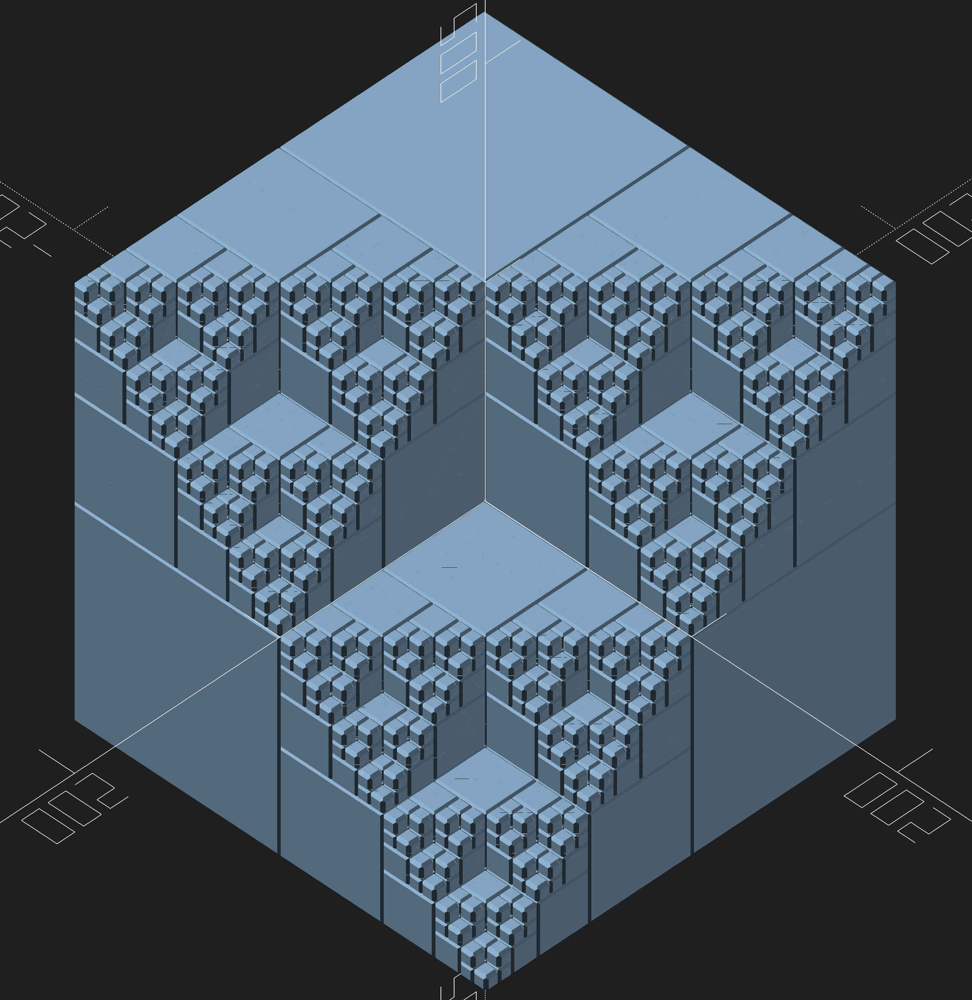

Sierpinski Hex Cube
===================

I saw a neat 2D fractal called a hex-a-sierpinski by fractal-kitty:
[hex-a-sierpinski](https://fractalkitty.com/2020/09/02/hex-a-sierpinski/),
and I thought to myself: "hey; that looks like a 3d object projected
isometrically", so I decided to construct a 3d version.

